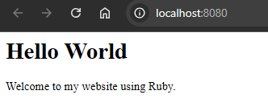

# TutoRuby

## Description

**TutoRuby** is a simple application developed in Ruby that displays the "Hello World" message in the web browser. It is ideal for beginners to learn Ruby and understand the basics of creating web servers.

<div align="center">
    
</div>

## Requirements

- Ruby 2.x or higher

## Installation

### Option 1: Manual Installation

1. Clone this repository:
   ```bash
   git clone https://github.com/Jonablo/tutoRuby.git
   ```

2. Go to the project directory:
   ```bash
   cd tutoRuby
   ```

3. Run the Ruby server:
   ```bash
   ruby servidor.rb
   ```

4. Open your browser and go to the following URL to see the application in action:
   ```
   http://localhost:8000
   ```

### Option 2: Using Docker

1. Pull the image from Docker Hub:
   ```bash
   docker pull jonablo/tuto-ruby
   ```

2. Run the container:
   ```bash
   docker run -p 8080:8000 jonablo/tuto-ruby
   ```

3. Open your browser and go to the following URL to see the application in action:
   ```
   http://localhost:8080
   ```

## Contributions

If you wish to contribute, please fork the repository, create a branch for your changes, make your modifications, and submit a pull request. I would appreciate any contributions, and all are welcome.

## License

This project is licensed under the MIT License.